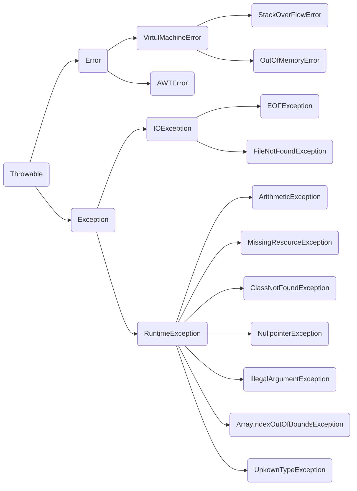

## Java 第一阶段笔记

### 一、Java环境

1. 以`.java`为后缀的文件为java程序的源文件，以`.class`结尾的文件为编译后的文件。在使用控制台运行java程序的时候，需要先使用`javac`命令编译源文件成`.class`文件，再使用`java`命令运行编译后的文件。需要注意的是编译时文件名要带后缀，运行时不带后缀。

2. `JDK`称为**Java开发工具包**，`JRE`称为**Java运行环境**，`JVM`称为**Java虚拟机**。JDK包含JRE，JRE包含ｊｖｍ。

3. Java语言之所以被称之为跨平台语言得益于有Java虚拟机， java源程序（.java文件）通过编译器编译成为Class文件（字节码文件），而它的class文件是基于字节码（以byte为单位存储的文件）的，而字节码文件是描述程序要运行的的虚指令的集合，这些虚指令的集合与任何的平台无关，Java虚拟机认识它（只要在不同的平台下部署相应的jre，运行jvm！就可以了）。

4. Java语言的特点：
   - 简单性
   - 面向对象
   - 分布性
   - 编译和解释性
   - 稳健性
   - 安全性
   - 可移植性
   - 高性能
   - 多线程性
   - 动态性
   
5. Java的技术体系：

   J2SE(Java 2 Platform Standard Edition)标准版

   - 是为开发普通桌面和商务应用程序提供的解决方案，该技术体系是其他两者的基础，可以完成一些桌面应用程序的开发。

   J2ME(Java 2 Platform Micro Edition)小型版

   - 是为开发移动设备和嵌入式设备(电器、机器人、机顶盒…)提供的解决方案。

   J2EE(Java 2 Platform Enterprise Edition)企业版

   - 是为开发企业环境下的应用程序提供的一套解决方案，该技术体系中包含的技术如 Servlet、Jsp等，主要针对于Web应用程序开发。

   Java FX

   Java Card

   Java TV

   Java DB

### 二、Java数据类型

1. 八大基本数据类型
	| 类型名称 | 字节空间 |
	| :------: | :------: |
	|   byte   |    1     |
	|  short   |    2     |
	|   int    |    4     |
	|   long   |    8     |
	|  float   |    4     |
	|  double  |    8     |
	|   char   |    2     |
	| boolean  |    1     |

3. 基本数据类型的字面量：整数为int，小数为double。

3. 若要用long类型接收超出int类型范围的整数，需要在整数后面加上后缀L
   若要用float类型接收float类型范围内的小数，需要在小数后面加上后缀f
   若要用double类型接收double范围内的整数，需要在整数后面加后缀d
   这里的后缀不区分大小写。

4. 隐式转换（小到大、自动转换）示意图：
   


5. 显示转换和隐式转换的区别：小类型转化为大类型系统自动转，大类型转化为小类型强制转换。

6. ==变量的四则运算会发生数据类型的转换。==

   ```java
   byte a=1,b=1;
   byte c=a+b;//这里会发生数据类型的转换,会报错
   byte d=a+1;//这里也会发生数据类型的转换，也会报错
   byte e=1+1;//这里不会发生数据类型的转换，不会报错
   final byte f=1,g=1;
   byte h=f+g;//这里不会发生数据类型的转换，因为f，g为常量
   ```

### 三、运算符

除一般运算符以外，重点介绍以下几种运算符

1. &&和&：前者叫短路与，在if语句中，当前一个表达式为false是，不会再运算第二个表达式的结果，后者会全部运算。

2. ||和|：与上面一样，前者是短路或，后者不会短路。&和|除了这两种用途外，同时还是按位运算符。

3. 按位运算符：&（与）、|（或）、~（非）、^（异或）

   - &（与）：将数据化为二进制形式后，相同位的两位都为1，那么结果为1，否则为0。

   - |（或）：将数据化为二进制形式后，相同位只要有一位为1，那么结果为1，全为0则为0。

   - ~（非）：非1=0，非0=1。

   - ^（异或）：将数据化为二进制形式后，相同位的两位不相同，那么结果为1，相同则为0。

     ```java
     //用异或的方式，不用临时变量实现变量的值交换。
     System.out.println("交换后：a="+a+",b="+b);
     int m=0;
     int n=1;
     System.out.println("交换前：m="+m+",n="+n);
     m=m^n;
     n=n^m;//n=n^m^n,根据异或的性质：a^b^a=b，则前面的表达式的结果是n=m
     m=m^n;//m^n^m,表达式的结果是m=n;完成了值的交换
     System.out.println("交换后：m="+m+",n="+n);
     ```

     ```java
     //使用异或和移位运算符求整数的绝对值
     int a=-5;
     int b=(a^(a>>31))-(a>>31);//右移31是因为只取符号位
     System.out.println(b);
     ```

     ```java
     //与运算符判断一个数的奇偶性
     int n=6;
     System.out.println((n&1)==1?"奇数":"偶数");
     //奇数最低位肯定是1，而1的二进制最低位也是1，其他位都是0，所以所有奇数和1与运算结果肯定是1。
     ```

     

4. 移位运算符：<< （左移）、>>（右移）、>>>（无符号右移）。

   - 左移（<<）：转为二进制后，各二进制位全部左移N位，高位丢弃，低位补0。正数可直接操作原码==对于负数，需将其转化为反码再转化为补码，对补码进行移位操作，再转化为反码，再转化为原码。==
   - 右移（>>）：转为二进制后，各二进制位全部右移N位，若值为正，则在高位插入 0，若值为负，则在高位插入 1。正数可直接操作原码==对于负数，需将其转化为反码再转化为补码，对补码进行移位操作，再转化为反码，再转化为原码。==
   - 无符号右移（>>>）：转为二进制后，各二进制位全部右移N位，无论正负，都在高位插入0。正数可直接操作原码==对于负数，需将其转化为反码再转化为补码，对补码进行移位操作，再转化为反码，再转化为原码。==

### 四、四则运算

1. 计算结果的数据类型，与最大类型保持一致

2. byte、short、char三种比int小的整数，运算时会先自动转换成int

3. 用异或、乘法除法实现三个变量的数值交换

   ```java
   public static void main(String[] args) {
   		// 使用乘法不引入临时变量交换三个变量的值
   		// a=b. b=c、c=a
   		int a = 1;
   		int b = 2;
   		int c = 3;
   		System.out.println("交换前：a=" + a + ",b=" + b + ",c=" + c);
   		a = a * b * c;
   		c = a / b / c;// a
   		b = a / b / c;// c
   		a = a / b / c;// b
   		System.out.println("交换后：a=" + a + ",b=" + b + ",c=" + c);
   		
   		//使用异或的方法
   		a = 1;
   		b = 2;
   		c = 3;
   		a = a ^ b ^ c;
   		c = a ^ b ^ c;
   		b = a ^ b ^ c;
   		a = a ^ b ^ c;
   		System.out.println("交换后：a=" + a + ",b=" + b + ",c=" + c);
   	}
   ```

4. 数据类型的字面值

   ```java
   public static void main(String[] args) {
   		byte a=1;
   		short b=2;
   		int c=3;
   		long d=4;
   		char e=5;
   		float f=6;
   		double g=7.0;
   		//定义时需要注意的是byte、short、char只能初始化为int类型的常量
   		//float初始化为整数时不用加f，但初始化为小数时必须加f
   		//long类型存int范围内的整数不需要加L，超过int且在long范围内必须加L
   		//byte aa=c;报错
   		//short bb=c;报错
   		//char ee=c;报错
   		long dd=c;//可以直接赋值int类型的变量给long	
   	}
   ```

5. 自增自减：符号在前，先变化后使用。符号在后，先使用后变化

   ```java
   byte a=1;
   //在这种情况下a+=4和a=a+4是有区别的。
   //a=a+4属于求和，会发生数据类型的自动自动转换
   //a+=4属于复合赋值运算，所以不会发生错误
   a+=4;
   //a=a+4;//会报错，因为这样赋值会发生数据类型的自动转换。
   	
   int b=1;
   b+=4;
   b=b+4;//这里不报错是因为b的类型本身就是int类型，不用转换。
   ```

6. switch语句：


### 五、方法


### 六、数组

1. 创建数组

   动态初始化和静态初始化

   - 动态初始化：`int[] a = new int[5];`
   - 静态初始化：`int[] a = new int[]{1,2,3,4,5};`。`int[] a={1,2,3,4,5};`

   创建数组有两种方式，三种方法（即上面的两种动态和静态方式，以及其中的三种方法)

2. 

### 七、面向对象

#### 1、内存管理

1. **栈**：存局部变量，先进先出
2. **堆**：存对象-new

#### 2、创建对象的流程
```java
Person p = new Person();//短短这行代码发生了很多事情
```

1. 把Person.class文件加载进内存
2.  在栈内存中，开辟空间，存放变量p
3. 在堆内存中，开辟空间，存放Person对象
4. 对成员变量进行默认的初始化
5. 对成员变量进行显示初始化
6. 执行构造方法（如果有构造代码块，就先执行构造代码块再执行构造方法）
7. 堆内存完成
8. 把堆内存的地址值赋值给变量p ，p就是一个引用变量，引用了Person对象的地址值

#### 3、构造方法

1. 类默认提供无参构造方法
2. 如果定义了有参构造方法，在需要调用其无参构造方法时，必须显式声明其无参构造方法

#### 4、代码块

1. 构造代码块

   - 成员位置（类里，方法外）的代码块叫构造代码块
   - 作用：抽取构造器的共性
   - 触发节点：new
   - new创建对象时执行构造器，若存在构造代码块，先执行构造代码块，再执行构造器
2. 局部代码块
   - 作用：控制变量的作用范围，出了局部代码块就不可以用了
   - 触发节点：调用方法时触发，按顺序执行
3. 静态代码块
   - 一段被花括号包起来的代码,而且被static修饰
   - 位置是在成员位置,也拥有static关键字的特点
   - 静态代码块用来完成项目的初始化
   - ==只加载一次==，在类第一次被加载时就跟着一起加载了(类的资源)
   - ==静态区域里只能调用静态资源，普通区域可以任意调用==
4. **代码块执行顺序**：静态代码块（只加载一次）>（构造代码块）>（构造方法）>（局部代码块）

#### 5、this关键字

1. 代表本类对象的一个引用对象（或者说，是本类的对象的引用）
2. 用来完成构造方法间的相互调用（只能单向调用，双向会引起死循环）
3. 在构造方法中使用this关键字必须放在第一行

*使用场景*：

1. 当要在附近有局部变量情况下使用和局部变量同名的成员变量时
2. 在构造器中调用其他构造器时

#### 6、继承

1. 概述：Java继承是使用已存在的类的定义作为基础建立新类的技术，新类的定义可以增加新的数据或新的功能，也可以用父类的功能，但不能选择性地继承父类/超类/基类。

2. 好处：提高父类代码的复用性,减少子类代码的编写,提高开发效率

3. 特点：
   - 使用extends关键字
   - 相当于子类把父类的功能复制了一份
   - java只支持单继承
   - 继承可以传递（爷爷，儿子，孙子的关系）
   - ==不能继承父类的私有成员==
   - 继承多用于功能的修改，子类可以拥有父类的功能的同时，进行功能拓展
   - 像是is a 的关系
   - ==构造器不能被继承==
   
4. 什么是OCP原则？

   Open Closed Principle（开闭原则）：

   （1）对扩展是开放的
   即当要扩展功能时，不必更改内部代码块，可以直接进行扩展；
   （2）对更改是封闭的
   对模块进行扩展时，内部代码无须改动。

   

   一个软件实体如类、模块和函数应该对扩展开放，对修改关闭。

   简单来说就是对添加开放，对修改关闭。

   当一个类写之后，我们对于类功能的增强应该基于当前类进行添加，而不是对当前类进行修改。

#### 7、super关键字

1. 当在子类中想用父类的成员变量
   - 子类和父类的变量名不同名时，可以省略super关键字
   - 子类和父类的变量名相同时，必须使用super关键字
2. super关键字相当于父类对象的引用

==Java共有53个关键字，其中包含2个保留字（goto，const）==

#### 8、static关键字

1. 可以修饰成员变量、成员方法
2. ==随着类的加载而加载，优先于对象加载==
3. ==只加载一次==，就会一直存在，不用开辟新的空间
4. ==全局唯一，全局共享==
5. 静态只能调用静态，非静态可以随意调用
6. ==static不能和this或者super共用，因为static比对象先加载==

#### 9、final关键字

1. 让子类的重写权限变得可控.如果父类的某个方法不让子类重写,可以用final修饰变成最终方法
2. 表示最终的意思.可以修饰类,成员变量,成员方法
3. final 修饰的类是最终的类,不能被继承
4. final 修饰的变量,是一个最终的变量,值不能被修改,称之为是常量
5. final 修饰的方法,不能被重写

#### 10、多态

1. 多态的前提是继承+重写
2. 要有方法的重写
3. 父类引用指向子类对象
4. 多态中,方法声明用--父类的 ,方法体用--子类的(因为重写了)
5. ==对于调用父类成员变量还是子类成员变量，只与变量的声明类型有关系，与实例化的类型没有关系。==
6. ==而对于调用父类方法还是子类方法，只与变量的实例化的类型有关系，与声明的类型没有关系，当然是在方法被重写的情况下，如果没有重写，则调用的是父类的方法。==

#### 11、重写

1. ==要求方法声明完全一致（返回值，方法名，参数列表）==
2. ===要求子类的权限修饰符大于等于父类的权限修饰符==
3. ==在子类的构造器中，默认就会存在super()——调用父类的无参构造器==
4. ==如果父类没有无参构造器（声明含参构造器后没显式声明无参构造器），子类的所有构造器都无法使用super()。==
5. 静态资源不存在重写，谁调用就是执行谁的功能
6. ==重写是指子类对父类方法的重写，成员变量是不能重写==
7. 

#### 12、异常

异常体系结构图



1. 异常提示的组成：异常的类型，异常的提示，异常的行号

2. Error:系统级错误，无法修复

3. Exception：程序bug，可修复

4. 异常的处理方式：捕获（推荐）、抛出

5. 捕获：把可能发生错误的代码包起来，尝试执行

   ```java
   try{
       //需要捕获的代码
   }catch(异常类型 异常名){
       //处理方案
   }
   //------------------------------------
   try{
     // 程序代码
   }catch(异常类型1 异常的变量名1){
     // 程序代码
   }catch(异常类型2 异常的变量名2){
     // 程序代码
   }finally{//无论是否发生异常，以下的代码总被执行
     //程序代码
   }
   ```

6. 抛出：在方法声明上加上throws 异常类型

    ```java
    mian() throws InoutMismatchException
    ```

7. ==异常处理五个关键字==
    |  关键字   |              解释              |
    | :-------: | :----------------------------: |
    |   `try`   |     执行可能产生异常的代码     |
    |  `catch`  |            捕获异常            |
    | `finally` | 无论是否发生异常，代码总被执行 |
    |  `throw`  |            抛出异常            |
    | `throws`  |            声明异常            |

8. `throw`和`throws` 的区别：

    ```java
    throw是语句抛出一个异常，一般是在代码块的内部，当程序现某种逻辑错误时由程序员主动抛出某种特定类型的异常
    throws表示出现异常的一种可能性，并不一定会发生这些异常，throw则是抛出了异常，执行throw则一定抛出了某种异常。
    
    1、Throw用于方法内部，Throws用于方法声明上
    2、Throw后跟异常对象，Throws后跟异常类型
    3、Throw后只能跟一个异常对象，Throws后可以一次声明多种异常类型
     
    Throw：
    作用在方法内，表示抛出具体异常，由方法体内的语句处理。
    具体向外抛出的动作，所以它抛出的是一个异常实体类。若执行了Throw一定是抛出了某种异常。
    
    Throws：
    作用在方法的声明上，表示如果抛出异常，则由该方法的调用者来进行异常处理。
    主要的声明这个方法会抛出会抛出某种类型的异常，让它的使用者知道捕获异常的类型。
    出现异常是一种可能性，但不一定会发生异常。
    ```

    

#### 13、访问控制符

1. 修饰符的关系：
   |     修饰符      |   本类   | 同一个包中的类 |     子类     |    其他类    |
| :-------------: | :------: | :------------: | :----------: | :----------: |
|     public      | 可以访问 |    可以访问    |   可以访问   |   可以访问   |
|    protected    | 可以访问 |    可以访问    |   可以访问   | ==不能访问== |
| 默认（default） | 可以访问 |    可以访问    | ==不能访问== | ==不能访问== |
|     private     | 可以访问 |  ==不能访问==  | ==不能访问== | ==不能访问== |
   
2. `public` > `protected` > `default` > `private`

#### 14、抽象类

没有方法体的方法我们称之为抽象方法，含有抽象方法的类我们称之为抽象类。

1. 特点：
   - 通过java关键字abstract实现
   - 可以修饰方法或者类，==不能修饰变量==
   - 抽象类中可以没有抽象方法（由子类去实现）
   - 如果类中有抽象方法，那该类必须定义为一个抽象类
   - 子类继承了抽象类以后，要么还是一个抽象类，要么就把所有抽象方法都重写
   - 多用于多态中
   - 抽象类不可以被实例化
2. ==抽象类也有构造方法，但是不能本身实例化==
3. 那抽象类的构造函数有啥用？==一般用于给子类实例化==
4. 既可以有变量，也可以有常量
5. ==抽象类里，既可以有普通方法，有可以有抽象方法==
6. 一个类如果继承了一个抽象类，要么重写所有的抽象方法，要么把自己也修饰成一个抽象类
7. 可以通过多态的方式调用抽象类的成员变量和成员方法
8. 抽象类里可以都是抽象方法，要求子类重写所有的抽象方法，否则就是一个抽象子类
9. 抽象类里可以都是普通方法，目的是不让外界实例化
10. 抽象类的方法到底是设计成普通方法还是抽象方法看具体的需求（方法体有没有必要存在）
11. 

==如果一个类不想被实例化，可以将构造器私有化，还可以将类修饰成抽象类==

#### 15、接口

Java里面由于不允许多重继承，所以如果要实现多个类的功能，则可以通过实现多个接口来实现。

Java接口和Java抽象类代表的就是抽象类型，就是我们需要提出的抽象层的具体表现。OOP面向对象的编程，如果要提高程序的复用率，增加程序的可维护性，可扩展性，就必须是面向接口的编程，面向抽象的编程，正确地使用接口、抽象类这些太有用的抽象类型做为java结构层次上的顶层。

interface 接口名{ 代码… }

1. 特点：

   - 接口中都是抽象方法
   - 通过interface关键字创建接口
   - 通过implements让子类来实现
   - 可以理解成，接口是一个特殊的抽象类
   - 接口突破了java的单继承的局限性
   - 接口和类之间可以多实现，接口和接口之间可以多继承
   - 接口是对外暴露的规则，是一套开发规范
   -  接口提高了程序的功能扩展，降低了耦合性

2. 接口里的“变量”必须初始化

3. 接口里的“变量”都是静态的

4. 接口里的“变量”都是常量

5. ==实际上，接口里没有变量，只能有公开的静态的常量==,默认就含有`public static final`

6. Java1.8以后，接口里可以存在普通方法，但接口里的普通方法必须使用默认的权限修饰符或是修饰成静态的static类

7. ==接口中的静态普通方法必须通过类名静态访问，对象名方式无法调用==

8. 接口里的方法，常量的声明都可以简写。接口会自动修饰完全

9. 接口的复杂用法：

   - 接口可以多继承
   - 接口可以多实现
   - 接口可以在单根继承的同时，多实现

10. ==eclipse中一个类在实现接口时出现的bug：==

    当准备好一个接口后（未保存—未编译），新建一个类实现这个接口，随后按照提示自动生成重写的方法，这时编译器报错！（The method xxxx of type xxxxx must override or implement a supertype method），此时的快速排错方案是：Remove '@Override' annotation。如果你点击快速排错删除‘@Override’后，还是会提示有错。对于这种现象其实就是因为实现的接口未保存，也就是未编译，你只需去到接口的界面Ctrl+S即可排除所有的错误。

11. 

#### 16、面向对象阶段的总结

1. **类和类间的关系**：extends

   单继承关系，子类拥有父类的所有功能（除私有的和构造器）。

   发生重写时，要求子类的方法声明与父类完全一致，并且权限不得小于父类的权限

2. **接口和接口的关系**：extends

   既可以单继承也可以多继承，子接口可以使用父接口的所有功能

3. **类和接口的关系**：implements

   既可以单实现也可以多实现

   抽象类可以使用接口中的所有功能，但是实现类需要重写实现的所有接口中的所有抽象方法，否则就是一个抽象的实现类。

   还可以在继承的时候多实现。

4. **抽象类和接口的区别**：

   - 相同点：

     都可以出现抽象方法

     都不能被实例化

     都需要子类重写抽象方法

     接口和抽象类都体现了继承结构里的抽象层

   - 不同点：

     抽象类里有构造方法，接口没有构造方法

     抽象类里有成员变量，接口里只能有公开的静态的常量

     抽象类里有普通方法，接口里都是抽象方法（Java1.8后可以存在静态或者默认的普通方法）

     接口里的成员可以简写，会自动补全

     接口和接口之间是继承关系，而且可以发生多继承

     实现类和接口之间是实现关系，而且是多实现

     接口是为了突破Java单继承的局限性

5. **抽象层的表现可以是接口也可以是抽象类，到底选择谁呢**？

   看需不需要提供方法体

   - 如果都是抽象方法，那就设计成接口，还可以多继承多实现更灵活

   - 如果有普通方法，那就不妨设计成抽象类，坏处是只能单继承

6. **Overload和Override的区别**：

   - Overload是重载
- Override是重写
   - ==重载体现的是编译时的多态，重写体现的是运行时的多态==

7. **this和super的区别**：

   - this代表本类对象的引用

   - super代表父类对象的引用

8. **&和&&的区别**：

   - 

9. **|和||的区别**：

10. **a+=4和a=a+4的区别**：

11. **隐式转换和显式转换的区别**：

#### 17、单例设计模式

单例模式指的是一个类，在一个JVM里，只有一个实例存在。

1. 饿汉式单例模式:

   ```java
   package charactor;
    
   public class GiantDragon {
    
       //私有化构造方法使得该类无法在外部通过new 进行实例化
       private GiantDragon(){
            
       }
    
       //准备一个类属性，指向一个实例化对象。 因为是类属性，所以只有一个
    
       private static GiantDragon instance = new GiantDragon();
        
       //public static 方法，提供给调用者获取12行定义的对象
       public static GiantDragon getInstance(){
           return instance;
       }
        
   }
   
   
   package charactor;
    
   public class TestGiantDragon {
    
       public static void main(String[] args) {
           //通过new实例化会报错
   //      GiantDragon g = new GiantDragon();
            
           //只能通过getInstance得到对象
            
           GiantDragon g1 = GiantDragon.getInstance();
           GiantDragon g2 = GiantDragon.getInstance();
           GiantDragon g3 = GiantDragon.getInstance();
            
           //都是同一个对象
           System.out.println(g1==g2);
           System.out.println(g1==g3);
       }
   }
   
   ```

2. 懒汉式单例模式：

   ```java
   package charactor;
    
   public class GiantDragon {
     
       //私有化构造方法使得该类无法在外部通过new 进行实例化
       private GiantDragon(){       
       }
     
       //准备一个类属性，用于指向一个实例化对象，但是暂时指向null
       private static GiantDragon instance;
         
       //public static 方法，返回实例对象
       public static GiantDragon getInstance(){
           //第一次访问的时候，发现instance没有指向任何对象，这时实例化一个对象
           if(null==instance){
               instance = new GiantDragon();
           }
           //返回 instance指向的对象
           return instance;
       }
         
   }
   
   
   package charactor;
    
   public class TestGiantDragon {
    
       public static void main(String[] args) {
           //通过new实例化会报错
   //      GiantDragon g = new GiantDragon();
            
           //只能通过getInstance得到对象
            
           GiantDragon g1 = GiantDragon.getInstance();
           GiantDragon g2 = GiantDragon.getInstance();
           GiantDragon g3 = GiantDragon.getInstance();
            
           //都是同一个对象
           System.out.println(g1==g2);
           System.out.println(g1==g3);
       }
   }
   ```

3. **饿汉式**是立即加载的方式，无论是否会用到这个对象，都会加载。
   如果在构造方法里写了性能消耗较大，占时较久的代码，比如建立与数据库的连接，那么就会在启动的时候感觉稍微有些卡顿。

   **懒汉式**，是延迟加载的方式，只有使用的时候才会加载。 并且有线程安全的考量
   使用懒汉式，在启动的时候，会感觉到比饿汉式略快，因为并没有做对象的实例化。 但是在第一次调用的时候，会进行实例化操作，感觉上就略慢。

   看业务需求，如果业务上允许有比较充分的启动和初始化时间，就使用饿汉式，否则就使用懒汉式

4. 单例模式三元素

   -  构造方法私有化
   - 静态属性指向实例
   - public static的 getInstance方法，返回第二步的静态属性

### 八、API

API:Application Programming Interface，应用程序接口

1. String类是被final修饰的，它不可以被继承，字符串类型的变量不可以被修改。字符串的拼接其实是通过底层自动创建了一个可变的StringBuffer类型的可变字符串对象，通过这个对象来完成字符串的拼接，再toString成String类型。只要有字符串变量参与的拼接都会产生新的对象。

2. String类的工具类StringBuilder/StringBuffer。

   ==面试考点；StringBuilder与StringBuffer的异同：==

3. 日期类Date

4. 日期工具类SimpleDateFormat

5. 商业计算工具类BigDecimal/BigInteger

   ==面试考点；BigDecimal与BigInteger的异同：==


### 九、IO流

1. ==输入流（Input）进行读操作，输出流（Out）进行写操作。==

2. 关于IO流的分类整理：

   |     分类     |      字节输入流      |      字节输出流       |    字符输入流     |     字符输出流     |
   | :----------: | :------------------: | :-------------------: | :---------------: | :----------------: |
   | ==抽象基类== |     InputStream      |     OutputStream      |      Reader       |       Writer       |
   | ==访问文件== |   FileInputStream    |   FileOutputStream    |    FileReader     |     FileWriter     |
   |   访问数组   | ByteArrayInputStream | ByteArrayOutputStream |  CharArrayReader  |  CharArrayWriter   |
   |   访问管道   |   PipedInputStream   |   PipedOutputStream   |    PipedReader    |    PipedWriter     |
   |  访问字符串  |          --          |          --           |   StringReader    |    StringWriter    |
   |  ==缓冲流==  | BufferedInputStream  | BufferedOutputStream  |  BufferedReader   |   BufferedWriter   |
   |    转换流    |          --          |          --           | InputStreamReader | OutputStreamWriter |
   |    对象流    |  ObjectInputStream   | ObjectOutputStream、  |        --         |         --         |
   |    对象流    |  FilterInputStream   |  FilterOutputStream   |   FilterReader    |    FilterWriter    |
   |    打印流    |          --          |      PrintStream      |        --         |    PrintWriter     |
   |  推回输入流  | PushbackInputStream  |          --           |  PushbackReader   |         --         |
   |    特殊流    |   DataInputStream    |   DataOutputStream    |                   |                    |

3. 字符流：只能操作字符文件.txt

4. ==字节流：可以操作任何数据，应用更加广泛，应重点了解==

5. Java里的路径需要两根反斜杠`\\`因为一根反斜杠表示转义，两根反斜杠才能转义成一个反斜杠`\`。

6. 一般父类都会做程序设计，可能设计为抽象类或者接口，都不能实例化，我们只需要学习其共性方法

7. 一般子类提供的方法都是继承自父类，没有单独研究的必要，只需要了解其构造方法，如何实例化

8. BufferedInputStream比FileInputStream快

9. 普通流控制追加还是覆盖。高级流只提高效率，自定义追加还是覆盖模式需要调用普通流的可自定义模式构造器

10. 关于字节流的常用构造方法及其方法：

    - FileInputStream

      ```java
      //实例化
      InputStram in = new FileInputStream(new File("path"));
      
      //方法
      int date = in.read();//返回值——int类型。一次只读一字节
      
      //当想一直读取文件到结尾时
      while((date=in.read)!=-1){
          System.out.println(date);
      }
      
      //关闭流
      in.close();
      ```

    - BufferedInputStream

      ```java
      //实例化
      InputStram in = new BufferedInputStream(new FileInputStream(new File("path")));
      ```

    - FileOutputStream

      ```java
      //实例化
      OutputStream out = new FileOutputStream(new File("path"),true/false);//最后的参数为选择追加还是覆盖模式
      //如果没有最后的参数，默认为覆盖模式
      
      //方法
      out.writer(97);//输入int类型的参数
      
      String s="";
      byte[] b=s.getBytes();
      out.writer(b);//输入参数为byte[]
      
      //关闭流
      out.close();
      ```

    - BufferedOutputStream

      ```java
      //实例化
      OutputStream out = new BufferedOutputStream(new FileOutputStream(new File("path")，true/false));
      //模式选择由普通流负责，高级流只提高效率
      ```


### 十、集合


#### 1、遍历集合

1. List的遍历：

   - 方式1.1：使用List继承来的Iterator迭代器遍历。我们通过while循环，通过调用其hasNaxt方法使其从开始遍历到最后。通过next方法返回遍历的数据

     ```java
     //方式1
     Iterator<Integer> iterator=list.iterator();
     while (iterator.hasNext()){
         System.out.println(iterator.next());
     }
     ```

   - 方式1.2：使用List自己的迭代器ListIterator来进行遍历。正向遍历与使用父类的Iterator方法一样

     ```java
     //方式2
     ListIterator<Integer> listIterator=list.listIterator();
     while (listIterator.hasNext()){
         System.out.println(listIterator.next());
     }
     ```

   - 方式1.3：当使用自己的迭代器Listiterator从前向后遍历完成后，可使用hasPrevious方法和previous方法从后向前遍历

     ```java
     //逆向遍历——必须先顺序遍历后才能进行逆向遍历
     while (listIterator.hasPrevious()){
         System.out.println(listIterator.previous());
     }
     ```

   - 方式2：单纯for循环。注意在这里List的长度是用size方法获取

     ```jav
     for (int i = 0; i <list.size() ; i++) {
         System.out.println(list.get(i));
     }
     ```

   - 方式3：foreach（增强for）

     ```java
     for (Integer i:list) {
         System.out.println(i);
     }
     ```

2. Set的遍历

   - 方式1：迭代器遍历

     ```java
     Iterator it=set.iterator();
     while (it.hasNext()){
         System.out.println(it.next());
     }
     ```

   - 方式2：foreach（增强for）

     ```java
     for (Integer i:set) {
         System.out.println(i);
     }
     ```

   - 方式3:

     ```java
     for (Object obj: sets) {
           if(obj instanceof Integer){
                     int aa= (Integer)obj;
                  }else if(obj instanceof String){
                    String aa = (String)obj
                  }
                   ……..
     }
     ```

3. Map的遍历

   - 方式1：先取出Map的keySet，再使用迭代器遍历set并使用get方法通过键获得值

     ```java
     Set<T> set=map.keySet();
     Iterator it=set.iterator();
     while(it.hasNext()){
         System.out.println(map.get(it.next()));
     }
     ```

   - 方式二：先取出Map的keySet，再使用foreach循环遍历set并使用get方法通过键获得值

     ```java
     Set<T> set=map.keySet();
     Iterator it=set.iterator();
     for(T i:it){
         System.out.println(map.get(i));
     }
     ```

   - 方式三：使用Collection集合接收由Map的values方法返回的集合，遍历这个集合即可得到Map的值

     ```java
     Collection<T> valueList=map.values();
     for(T o:valueList){
         System.out.println(o);
     }
     ```

   - 方式四：使用Set<Map.Entry<Integer,String>>接收由map.entrySet方法返回的Entry类型的Set集合，其中Entry类型是封装好的单独的键值对

     ```java
     Set<Map.Entry<T,V>> set=map.entrySet();
     for(Map.Entry<T,V> entry:set ){
         System.out.println(entry.getKey()+":"+entry.getValue);
     }
     ```

   - 方法五：使用Set<Map.Entry<Integer,String>>接收由map.entrySet方法返回的Entry类型的Set集合后直接使用迭代器遍历set中的元素

     ```java
     Set<Map.Entry<T,V>> set=map.entrySet();
     Iterator it=set.iterator();
     while(it.hasNext()){
         System.out.println(it.next());
     }
     ```

#### 2、知识点汇总

1. 泛型：

   - 泛型用在方法上，需要体现在两个位置：返回值前、参数列表中

     ```java
     public <E> void print(E e) {}
     ```

   - 泛型用在接口/类上，需要在类名后添加泛型约束

     ```java
     public interface Collection<E> {}
     ```

   - 泛型常用名称

     1. E——Element（在集合中使用）
     2. T——Type（Java类）
     3. K——Key（键）
     4. V——Value（值）
     5. N——Number（数值类型）
     6. ？——表示不确定的类型

   - 泛型< >，其中尖括号里必须是引用类型，不能是基本类型

2. ArraryList和LinkedList

   - ArraryList底层使用的是Object数组，LinkedList底层用的是双向循环链表
   - ArraryList适用于访问，LinkedList适用于增删
   - 二者都是线程不安全的

3. HashSet和TreeSet以及LinkedHashSet

   - 详见下图

4. Map

   - map是无序的
   - map是键值对key-value类型
   - key重复的话，value会被覆盖
   - 

5. HashMap和HashTable以及ConcurrentHashMap

   - 详见下图

### 十一、Java数据结构

1. 
2. 
3. 

### 十二、多线程

1. 进程：是程序的一次运行活动，是系统资源分配和调度的一个独立单位，有独立的地址空间和系统资源。打开一个浏览器、一个聊天窗口分别是一个进程。进程可以有多个子任务，如聊天工具接收消息、发送消息，这些子任务是线程。==资源分配给进程，线程共享进程资源==。

2. 线程：是CPU调度和分配的基本单位。一个进程可由多个线程的执行单元组成，每个线程都运行在同一进程的上下文中，共享同样的代码和全局数据。每个进程至少有一个主执行线程，它无需由用户主动创建，一般由系统自动创建。系统创建好进程后，实际上就启动了执行该进程的执行主线程，执行主线程以函数地址形式，即程序入口函数（如 main函数），将程序的启动点提供给操作系统。主执行线程终止了，进程也就随之终止。

   | 对比     | 进程                                                         | 线程                                                         |
   | -------- | ------------------------------------------------------------ | ------------------------------------------------------------ |
   | 定义     | 进程是程序运行的一个实体的运行过程，是系统进行资源分配和调配的一个独立单位 | 线程是进程运行和执行的最小调度单位                           |
   | 系统开销 | 创建撤销切换开销大，资源要重新分配和收回                     | 仅保存少量寄存器的内容，开销小，在进程的地址空间执行代码     |
   | 拥有资产 | 资源拥有的基本单位                                           | 基本上不占资源，仅有不可少的资源（程序计数器，一组寄存器和栈） |
   | 调度     | 资源分配的基本单位                                           | 独立调度分配的单位                                           |
   | 安全性   | 进程间相互独立，互不影响                                     | 线程共享一个进程下面的资源，可以互相通信和影响               |
   | 地址空间 | 系统赋予的独立的内存地址空间                                 | 由相关堆栈寄存器和和线程控制表TCB组成，寄存器可被用来存储线程内的局部变量 |

3. 并发：并发是把CPU运行时间划分成若干个时间段，每个时间段再分配给各个线程执行，当一个线程在运行时，其它线程处于挂起状。从宏观角度是同时进行的，但从微观角度并不是同时进行。

   

4. 并行：并行是同一时刻当一个CPU执行一个线程时，另一个CPU可以执行另一个线程，两个线程互不抢占CPU资源，是真正意义上的不同线程在同一时刻同时执行。

    

5. 同步：

6. 异步：

7. 线程的五个状态：新建、就绪、运行、阻塞、死亡

8. 实现多线程方式1——继承Thread类

   ```java
   public class Test1 {
       public static void main(String[] args) {
           MyThread myThread=new MyThread();//就绪状态
            myThread.setName("--线程1--");
           myThread.start();//可运行状态
           MyThread myThread1=new MyThread();
           myThread1.setName("--线程2--");
           myThread1.start();
       }
   }
   
   class MyThread extends Thread{
       @Override
       public void run() {//运行状态
           super.run();
           for (int i = 0; i < 20; i++) {
               System.out.println(getName());
           }
       }
       //死亡（结束）状态
   }
   ```

   

9. 实现多线程方式2——实现Runnable接口

   ```java
   public class Test2_Runnable {
       public static void main(String[] args) {
           MyRunnable myRunnable=new MyRunnable();
           Thread thread=new Thread(myRunnable);
           thread.start();
           Thread thread1=new Thread(myRunnable);
           thread1.start();
       }
   
   }
   
   class MyRunnable implements Runnable{
   
       @Override
       public void run() {
           for (int i = 0; i <20 ; i++) {
               System.out.println(Thread.currentThread().getName()+"=="+i);
           }
       }
   }
   
   ```

10. 售票案例：

    需求：设计4个售票窗口，需要售票100张

    ```java
    package cn.tedu.thread;
    
    /**
     * 测试 多线程售票
     * @author sharetown
     * @date 2020/8/21 17:28
     */
    public class Test_Tickets {
        public static void main(String[] args) {
            //1、创建线程对象
            MyTickets myTickets1=new MyTickets();
            //2、启动买票线程
            myTickets1.start();
            MyTickets myTickets2=new MyTickets();
            myTickets2.start();
            MyTickets myTickets3=new MyTickets();
            myTickets3.start();
            MyTickets myTickets4=new MyTickets();
            myTickets4.start();
    
    
        }
    }
    //1、继承Thread类实现多线程编程
    class MyTickets extends Thread{
        //需求：设计4个售票窗口，总计售票100张
        //定义变量，记录票数
        int tickets=100;
        //2、开始买票业务
        @Override
        public void run() {
            super.run();
            while (tickets>0){
                System.out.println(getName()+"----"+tickets--);
            }
        }
    }
    ```
    
11. 以上代码虽然开辟了四个线程，但每个线程都是独立工作的，每个窗口都卖了一百张。

12. 解决方案第一阶段（不完善）：将资源改为静态资源，即加static关键字修饰

     ```java
     static int tickets=100;
     ```

13. 解决方案第二阶段：加锁

14. 同步锁—synchronized

      - 概述

      - 用法：通过synchronized关键字实现同步锁

        ​			==用在方法上：synchronized 权限修饰符 返回值 方法名([参数列表]) {}==

        ​			==用在代码块上：synchronized(锁对象){ 需要同步的代码 }==

        ​			用在方法上，使用锁对象默认就是this。用在代码块上时，锁对象可以任意

15. 同步和异步的区别

      - 同步：是指。同一时刻，有钥匙的是独占资源的，共享资源没有人抢，没有钥匙的人只能等待
      - 异步：是指，同一时刻，没人排队，大家抢着去用共享资源
      - 效率上来讲：异步>同步
      - 安全上来讲：同步>异步
      - 同步可以提高安全性，但是牺牲了效率/性能。异步提高了效率，但是牺牲了安全

16. 多线程里的共享资源是被抢占的，是一个异步的，大家都去抢没人排队等待

      解决方案：加锁，这样保证了数据的安全，因为同一时刻的共享资源是被独占的，但是降低了效率。加锁实现了一个同步的效果，就是有钥匙的排队等待，没钥匙的排队等待，虽然效率低，但是安全。

17. 怎么判断程序中，数据有没有多线程编程时的安全隐患

      ==如果有多条语句操作了共享资源，一定会有多线程的安全隐患，必须加锁==

18. 加锁在代码块上时，锁对象的选择形式：

      - synchronized(new Object()){}——锁住了不同的对象

      - Object obj = new Object();

        synchronized(obj){}——锁住了同一个对象

        或者

        synchronized(this){}——锁住了同一个对象

      - synchronized(类名.class){}——当数据是静态的时。锁了本类，仅针对静态

19. 拓展：读写锁

### 十三、注解

1. 自定义注解

   ```java
   @interface MyAnnotation{
       String local() default "class";
       String value() default "";//特殊属性value
   }
   ```

2. 为自定义注解添加位置和生命周期约束

   ```java
   //@Target(ElementType.METHOD)//描述注解可以出现的位置
   @Target({ElementType.TYPE,ElementType.FIELD,ElementType.METHOD})//描述注解可以出现的位置——多个位置上
   @Retention(RetentionPolicy.SOURCE)//描述注解的生命周期
   ```

3. 自定义注解的使用

   ```java
   //2、使用注解：@MyAnnotation
   @MyAnnotation
   class Hello{
       @MyAnnotation(local = "field")
       String name;
       @MyAnnotation(local = "method")
       public void show(){
       }
   }
   ```

### 十四、反射

1. 作用：

   - 拿到.class文件里的数据进行解析

   - 获取文件里的所有数据（公开的、私有的、构造、属性、方法）
   - 所有数据都封装在`Class`工具类身上

2. 获取Class对象

   - Class.forName("类的全路径");
   - 类名.class;
   - 对象.getClass();

3. 普通反射的应用

   - 获取Class对象

     ```java
     public static void method() throws ClassNotFoundException {
             Class aClass1 = Class.forName("cn.tedu.reflection.Student");
             Class aClass2 = Student.class;
             Class aClass3 = new Student().getClass();
         }
     ```

   - 获取构造方法

     ```java
     public static void method2() throws NoSuchMethodException {
             Class aClass = Student.class;
             //调用方法
             Constructor[] cs = aClass.getConstructors();//获取所有公开的构造器
             Constructor c = aClass.getConstructor();//获取一个构造器，默认无参构造
             Constructor[] ccc=aClass.getDeclaredConstructors();//获取所有构造器（包括私有的）
             for (Constructor cc : ccc) {
                 //获取构造方法的名字
                 System.out.println(c.getName());
                 //获取构造方法的参数
                 Class[] ct = cc.getParameterTypes();//获取方法的参数列表
                 System.out.println(Arrays.toString(ct));
             }
         }
     ```

   - 获取成员方法

     ```java
     public static void method3() {
             Class clazz=Student.class;
             Method[] methods=clazz.getMethods();//获取公开的所有成员方法们（包括自己的和父类的公开的方法）
             Method[] me=clazz.getDeclaredMethods();//获取自己的所有成员方法（包括私有的）
     
             for (Method method :me) {
                 System.out.println(method.getName());//获取方法名
                 Class[] cc=method.getParameterTypes();//获取每个方法的参数列表
                 System.out.println(Arrays.toString(cc));
             }
         }
     ```

   - 获取成员变量

     ```java
     public static void method4() {
             Class clazz=Student.class;
             Field[] fields=clazz.getFields();//获取公开的成员变量（不公开无法获取）
             Field[] fields1=clazz.getDeclaredFields();//获取全部的成员变量，包括私有的=
             for (Field f:fields1) {
                 System.out.println(f.getName());//获取变量名
                 System.out.println(f.getGenericType());//获取数据类型
                 System.out.println(f.getType());//获取数据类型
             }
         }
     ```

   - 通过反射技术创建对象

     ```java
     public static void method5() throws Exception {
             Class<Student> clazz=Student.class;
             Student stu=clazz.newInstance();//通过这种方式实例化其实也要出发构造器，而且触发的是无参构造
             System.out.println(stu);
     
             //如何触发含参构造
             //getConstructor(String.class)匹配构造方法里参数的类型的class对象
             Constructor<Student> c1=clazz.getConstructor(String.class);
             Constructor<Student> c2=clazz.getConstructor(String.class,int.class);
             Constructor<Student> c=clazz.getConstructor(String.class,int.class,double.class);
             Student jack=c.newInstance("jack",22,149.0);
             Student Rose=c1.newInstance("Rose");
             Student Jnmus=c2.newInstance("Jnmus",22);
             System.out.println(jack);
             System.out.println(Rose);
             System.out.println(Jnmus);
         }
     ```

#### 2、暴力反射

不仅能获取类的public资源，也可以获取类里的private资源

1. 使用反射调用方法

   暴力反射除了正确的使用相应的API以外，还需要开启访问权限

   ```java
   public static void method3() throws Exception {
           Class<Person> clszz=Person.class;
           Method e = clszz.getDeclaredMethod("eat");
           //暴力反射：除了使用正确的API，另外还需要开启访问权限
           e.setAccessible(true);
           Person p=clszz.newInstance();
           e.invoke(p);
   
       }
   ```

2. 使用反射操作类的成员变量

   ```java
   public static void method2() throws Exception {
           Class<Person> p=Person.class;
           Field[] fie=p.getDeclaredFields();
           Field ff=p.getDeclaredField("name");//拿到名为name的成员变量的对象
           ff.setAccessible(true);//打开权限
           Person obj=p.newInstance();
           ff.set(obj,"jack");//给成员变量赋值
           System.out.println(ff.get(obj));//获取成员变量的值
           for (Field f:fie) {
               System.out.println(f.getName());
               System.out.println(f.getType().getName());
           }
       }
   ```

### 十五、内部类

准备一个外部类和内部类

```java
class Outer{//外部类
    String name="jack";
    public void out(){
        System.out.println("out()");
    }

    class Inner{//内部类
        int age;
        public void in(){
            System.out.println("in()");
        }
    }
}
```

**特点：**

1. 内部类可以直接使用外部类的成员

2. 外部类想访问内部类的成员，必须创建内部类的对象

3. 在其他类中调用一个内部类中资源的方法：`外部类的对象.内部类的对象.想要调用的内部类资源`

4. 定义内部类的对象的方式为：`外部类名.内部类名 变量名`。其实`外部类名.内部类名`就是变量的类型

   ```java
   Outer.Inner outIn=new Outer().new Inner();//实例化内部类对象
   ```

#### 1、成员内部类

位置在成员位置（类里方法外）的内部类叫成员内部类

成员内部类可以被private、static修饰

#### 2、局部内部类

位置在局部位置（方法里）的内部类叫局部内部类

#### 3、静态内部类


#### 4、匿名内部类

通常存在局部位置（方法里），通常要配合匿名对象使用

### 十六、Socket网络编程


### 十七、Lambda表达式

1. 语法：（参数列表）->{方法体}

2. 要求：接口里只能有一个抽象方法

3. 与匿名内部类比较

   ```java
   public class TestLambda {
       public static void main(String[] args) {
           //匿名内部类
           Inter in=new Inter() {
               @Override
               public void save() {
                   System.out.println("数据保存成功");
               }
           };
           in.save();
           
           
           //Lambda表达式——要求：接口里只能有一个抽象方法
           //语法：（参数列表）->{方法体}
           Inter inter=()->{
               System.out.println("Lambda表达式");
           };
           inter.save();
       }
   }
   interface Inter{
       void save();
   }
   
   ```

4. 当接口的抽象方法有参数时

   ```java
   interface Inter2{
       void save(int id);
   }
   public static void main(String[] args) {
           Inter2 inter2=(int a)->{//括号里需要保持与抽象方法的参数列表类型一致
               System.out.println(a);
           };
           inter2.save(10);//调用时传参
       }
   ```

5. 有参数有返回值时

   ```java
   interface Inter3{
       int save(String name);
   }
   public static void main(String[] args) {
           Inter3 inter3=(String name)->{
             return 100;//有返回值就得按要求返回
           };
           System.out.println(inter3.save("das"));
       }
   ```

### 十八、正则表达式

字符串与正则表达式进行匹配的方法，由String类提供提供一个返回值为boolean类型的实例方法——matches()。

```java
public static void main(String[] args) {
        System.out.println("请输入手机号码：");
        String number=new Scanner(System.in).nextLine();
        //判断格式是否正确
        String reget="[1][0-9]{10}";
        System.out.println(number.matches(reget));
    }
```


